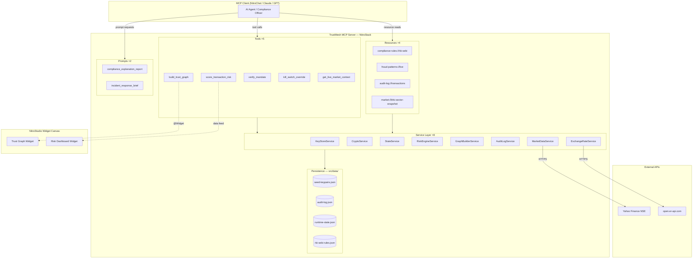
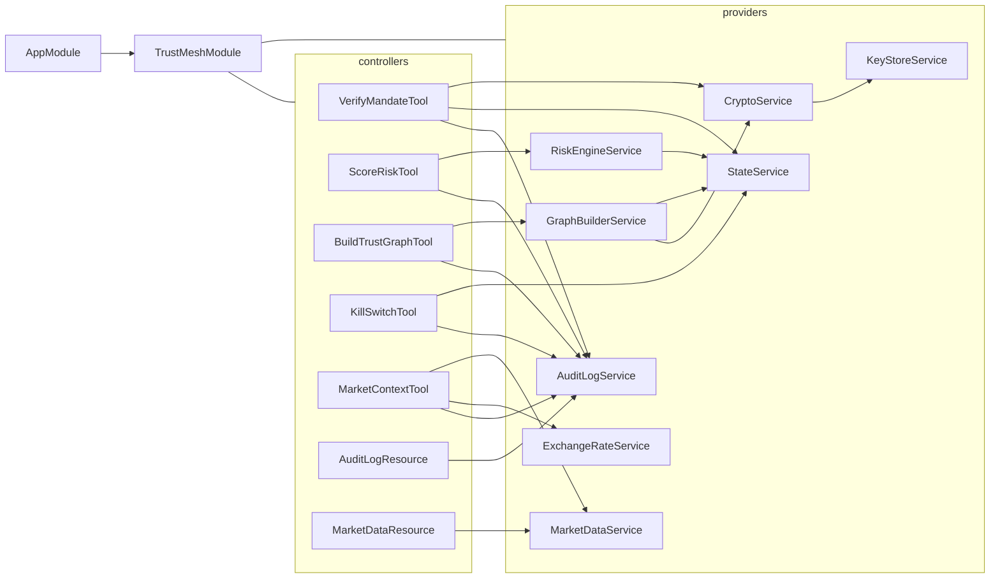
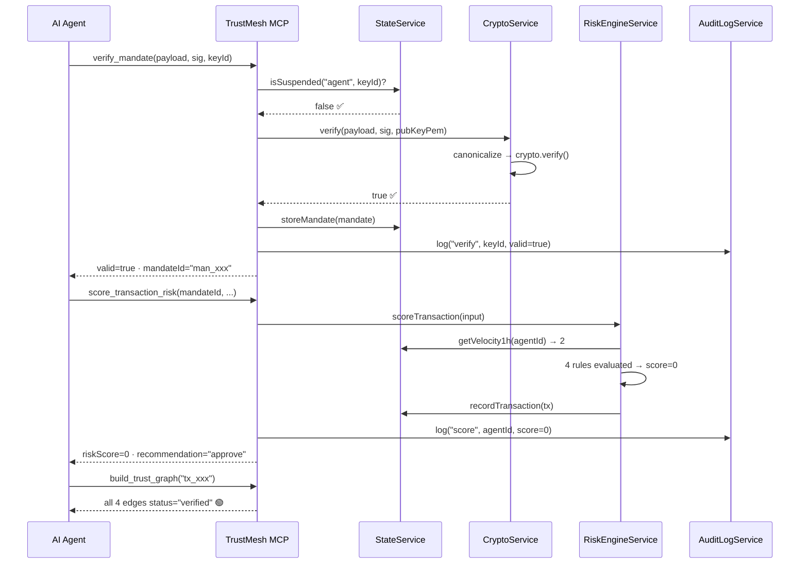
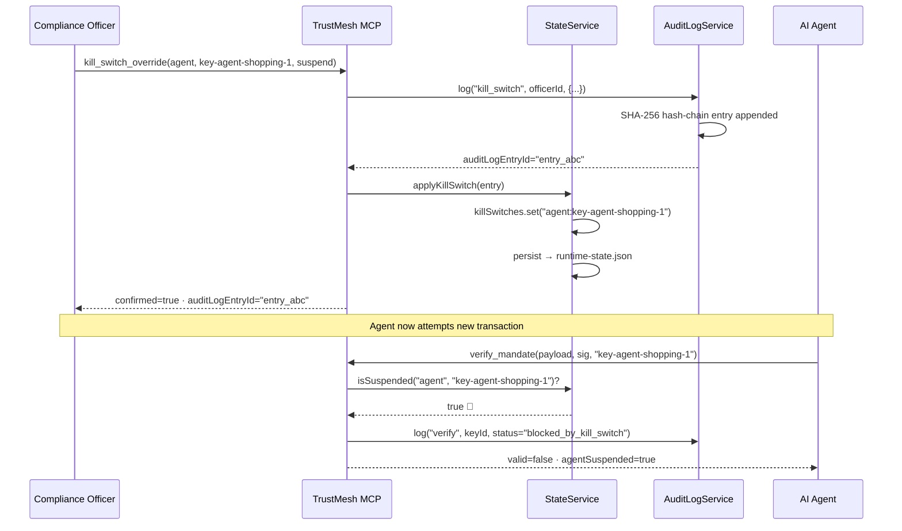

# Dink.Trust — Agentic Payment Trust & Compliance Firewall

[](https://docs.nitrostack.ai)
[](#)
[](#rbi-compliance-mapping)
[](#)

> **Amrita University MCP Hackathon 2026 — BFSI & FinTech Track Submission**
> Built using the **NitroStack Framework**

---

## 1. One-Line Pitch

TrustMesh is an MCP compliance firewall that **cryptographically verifies AI agent payment mandates**, scores transaction risk with **explainable rules enriched by live NSE market data**, visualises the mandate chain as an **interactive trust graph widget**, and enforces an **RBI MRM 2026-compliant human-in-the-loop kill switch**.

---

## 2. Problem Statement

### 2.1 The Emerging Gap in Agentic Commerce
Google AP2, Mastercard Agent Pay, and Visa Trusted Agent Protocol are rolling out through 2026. AI shopping agents now **autonomously sign and execute payment mandates** without the user present at every step.

**The attack surface:** A compromised or misconfigured agent can:
- Boost a ₹250 cart to ₹25,000 by altering the payload post-signing.
- Route a payment to an unauthorised merchant outside the original mandate scope.
- Exceed velocity limits through burst transaction injection.
- Operate from a geographically anomalous location undetected.

### 2.2 The Regulatory Deadline
The Reserve Bank of India's **draft Model Risk Management (MRM) Guidelines 2026** (public comment closes **July 24, 2026**) mandate strict controls on automated clearing systems. TrustMesh implements all key directives:

*   **§4.2(a):** Real-time kill switches on all automated AI clearing systems.
*   **§5.1:** Non-black-box, explainable decision logic for all risk scoring.
*   **§4.5:** Human-in-the-loop routing for medium-to-high risk transactions.
*   **§6.3:** Immutable, tamper-evident audit trails for every clearance action.

---

## 3. Solution Overview

TrustMesh acts as a firewall between AI agents and financial clearing rails:

```
🔐 Cryptographic Verification   →  Ed25519 signature validation on mandates
📊 Explainable Risk Scoring     →  Rule-weighted, auditable score (0–100)
📡 Live Market Enrichment       →  NSE BFSI stock prices + FX rates API integration
🚨 Compliance Kill Switch       →  Real-time suspend/block + hash-chained audit log
🔗 Visual Trust Chain Graph     →  Spring-physics graph rendered in NitroStudio
```

### Primitives Exposed to Models

| Primitive | Count | Details |
|-----------|-------|---------|
| **Tools** | 5 | verify_mandate, score_transaction_risk, build_trust_graph, kill_switch_override, get_live_market_context |
| **Resources**| 4 | compliance-rules, fraud-patterns, audit-log, market-bfsi-snapshot |
| **Prompts** | 2 | compliance_explanation_report, incident_response_brief |

---

## 4. System Architecture

### 4.1 High-Level Component Map



---

### 4.2 Module Dependency Graph



---

### 4.3 Data Flow — Normal Verify & Clear



---

### 4.4 Data Flow — Kill Switch Triggered



---

## 5. Component Deep-Dive

### 5.1 KeyStoreService
Auto-generates 5 Ed25519 keypairs on first boot:

| Key ID | Entity | Role |
|--------|--------|------|
| `key-issuer-mastercard` | Mastercard Clearing | issuer |
| `key-issuer-visa` | Visa Trusted Agent | issuer |
| `key-agent-shopping-1` | ShopBuddy AI Agent | agent |
| `key-agent-shopping-2` | ProcureBot Agent | agent |
| `key-merchant-amazon` | Amazon Web Stores | merchant |

Public keys are stored in `seed-keypairs.json`. Private keys are stored in `dev-private-keys.json` (gitignored).

### 5.2 CryptoService
*   `canonicalize(payload)` — deterministically sorts JSON keys alphabetically before stringifying.
*   `verify(payload, sig, keyId)` — looks up the key in the store, re-canonicalizes the payload, and performs an asymmetric cryptographic check. Changing a single character breaks verification.

### 5.3 StateService
Persists real-time states to `runtime-state.json`:
- **Kill-switch registry:** Maps active overrides (`agent`, `mandate`, or `transaction`).
- **Transaction registry:** Velocity ledger used to check transaction rates.
- **Mandate registry:** Caches verified mandates for cross-check analysis.

### 5.4 AuditLogService
Produces a sequentially chained SHA-256 hash ledger in `audit-log.json`:
```
entryHash = SHA-256(id + timestamp + action + actorId + details + previousEntryHash)
```
Any tampering breaks the chain. Served via `audit-log://transactions`.

### 5.5 RiskEngineService
Evaluates transaction anomalies using rule-based metrics:

| Factor | Weight | Trigger |
|--------|--------|---------|
| **Signature Check Failed** | +100 | Crypto verification returns false (auto-block) |
| **Merchant Scope Mismatch** | +30 | Cart mandate merchant ≠ clearing merchant |
| **Geographic Mismatch** | +20 | Agent request region ≠ user home region |
| **Velocity Limit Exceeded** | +25 | Agent transaction count in last 1 hour > 5 |

### 5.6 MarketDataService & ExchangeRateService
*   **Market Data:** Connects to Yahoo Finance to fetch live stock statuses for major Indian banks (HDFC, ICICI, SBI). Computes overall sector sentiment (`bullish` / `bearish`). If market sentiment is bearish, risk thresholds tighten by 5 points.
*   **Exchange Rates:** Calls `open.er-api.com` to fetch live currency conversion rates, converting USD/EUR transactions to INR before running limits evaluation.

---

## 6. MCP Primitives Reference

### 6.1 Tools (Actions)

#### `verify_mandate`
Cryptographically verifies an agent mandate signature.
```json
// Input
{
  "mandateType": "cart",
  "payload": { "merchant": "Amazon Web Stores", "amount": 250, "currency": "INR" },
  "signature": "<base64-signature>",
  "signerPublicKeyId": "key-agent-shopping-1"
}

// Output (Success)
{ "valid": true, "signatureVerified": true, "mandateId": "man_abc", "agentSuspended": false }
```

#### `score_transaction_risk`
Computes rule-weighted risk assessment.
```json
// Input
{
  "mandateId": "man_abc", "amount": 250, "merchantCategory": "Amazon Web Stores",
  "agentId": "key-agent-shopping-1", "requestGeo": "IN-TN", "userHomeGeo": "IN-TN"
}

// Output
{
  "riskScore": 0,
  "recommendation": "approve",
  "explanation": "Transaction exhibits clean parameters and normal agent velocity."
}
```

#### `build_trust_graph`
Returns the full chain graph. Emits to the `trust-graph` widget.
```json
// Input: { "transactionId": "tx_abc123" }
```

#### `kill_switch_override`
Enforces emergency compliance overrides.
```json
// Input
{
  "targetType": "agent", "targetId": "key-agent-shopping-1",
  "action": "suspend", "reason": "Suspected API compromise", "actorId": "officer-01"
}
```

#### `get_live_market_context`
Queries external APIs for live stock indices and currency conversions.
```json
// Input: { "transactionCurrency": "USD", "transactionAmount": 50 }
```

### 6.2 Resources (Context Data)
*   `compliance-rules://rbi-sebi` — RBI MRM guidelines.
*   `fraud-patterns://live` — List of active threat indicators and weights.
*   `audit-log://transactions` — Chained compliance ledger.
*   `market://bfsi-sector-snapshot` — Live stock lists and calculated market indices.

### 6.3 Prompts (Templates)
*   `compliance_explanation_report` — Drafts regulatory audit brief.
*   `incident_response_brief` — Drafts official kill-switch escalation reports.

---

## 7. How to Run

### Step 1 — Install dependencies
```bash
npm install
```

### Step 2 — Run Key Setup & Seeding
```bash
npm run setup
```
This generates public/private Ed25519 keys and compiles the cryptographically pre-signed mandates inside `src/data/seed-mandates.json`.

### Step 3 — Run Development Server
```bash
npm run dev
```
The server will boot locally using the **stdio transport** layer. Link it inside your **NitroStack Studio** or **Desktop Client** to test the tools.

### Step 4 — Run Demo Scenarios

#### Scenario A: Valid Transaction clearing
1. In NitroStudio, call `verify_mandate` using the `mandate-cart-amazon` payload from `seed-mandates.json`.
2. Call `score_transaction_risk` using the returned mandate ID.
3. Call `build_trust_graph` → Nodes and links render in solid green.

#### Scenario B: Tampered Mandate Block
1. Call `verify_mandate` using the `mandate-cart-tampered` payload.
2. Cryptographic signature check will fail (`valid: false`).
3. Call `score_transaction_risk` with `signatureInvalid: true` → Score flags as `100/100` (Block).
4. Call `build_trust_graph` → The Agent-to-Merchant link pulses as a dashed crimson line in the widget.

#### Scenario C: Kill Switch Enactment
1. Call `kill_switch_override` targeting `key-agent-shopping-1` with action `suspend`.
2. Re-run Scenario A → The transaction is blocked instantly (`agentSuspended: true`).

#### Scenario D: Cross-Currency Market Context
1. Call `get_live_market_context` with `USD` currency and amount `50` to pull live FX conversion and macro BFSI sector indicators.

---

## 8. Demo Script — Word-for-Word (2 Minutes)

> **Preparation:** Open **NitroStack Studio** showing the tool options. Have the JSON payloads ready to copy-paste.

---

### ⏱️ 0:00 – 0:18 (Introduction)
*   **What to show:** NitroStudio tool sidebar.
*   **Voiceover:**
    > *"It is 2026. Under protocols like Google AP2 and Mastercard Agent Pay, AI agents are now autonomously signing and clearing transaction mandates. But how do we ensure these agents aren't tampered with? Meet TrustMesh: an MCP compliance firewall that verifies cryptographic agent mandates, runs explainable risk rules, and implements an RBI 2026-compliant kill switch."*

---

### ⏱️ 0:18 – 0:45 (Scenario A — Valid Clearing)
*   **What to do:** Call `verify_mandate` with the valid Amazon mandate payload. Then call `score_transaction_risk`. Finally, load the trust graph widget.
*   **Voiceover:**
    > *"Let's process a valid transaction. An AI assistant submits a ₹250 cart. We call verify mandate. Signature verifies successfully using standard Ed25519 cryptography. Next, we score the risk. Because there is no geographic or merchant scope mismatch, the score is zero and clearing is approved. The live spring-physics widget shows a fully validated trust chain glowing green, from the User all the way to RBI clearing rails."*

---

### ⏱️ 0:45 – 1:12 (Scenario B — Tampered Mandate)
*   **What to do:** Call `verify_mandate` with the tampered mandate payload (where amount was boosted to ₹25,000 post-signing). Score risk. Show graph widget updating.
*   **Voiceover:**
    > *"But what if a compromised agent boosts the cart to ₹25,000 post-signing? We run verification. The cryptographic signature validation fails immediately. The risk engine generates a score of 100, recommending a hard block. On our live visualizer, the compromise is immediately highlighted: the link between the Agent and the Merchant pulses in dashed red, isolating the transaction."*

---

### ⏱️ 1:12 – 1:38 (Scenario C — Emergency Kill Switch)
*   **What to do:** Call `kill_switch_override` targeting the agent key with action `suspend`. Re-run verification. Read audit log resource.
*   **Voiceover:**
    > *"Under RBI Model Risk Management guidelines, human overrides must act instantly. A compliance officer invokes our kill switch tool to suspend the agent. Re-running the transaction shows the agent is blocked immediately. The event is written to our tamper-evident audit resource, secured by a sequentially chained SHA-256 hash log, matching RBI Section 6.3."*

---

### ⏱️ 1:38 – 2:00 (Scenario D & Wrap Up)
*   **What to do:** Call `get_live_market_context` showing live NSE and currency rates. Point to README compliance table.
*   **Voiceover:**
    > *"Finally, we query live market context. Sourcing rates from Yahoo Finance, the system converts multi-currency items to INR and adjusts risk limits on the fly based on banking sector sentiment. TrustMesh delivers all four core RBI MRM requirements. It is a deployable compliance firewall built on NitroStack, ready for production before the RBI 2026 deadline. Thank you."*

---

## 9. RBI Compliance Mapping

| Section | Requirement | TrustMesh Implementation | Source Code |
|---|---|---|---|
| **§4.2(a)** | Real-time operational kill switches | `kill_switch_override` suspends target instantly | [kill-switch.tool.ts](file:///c:/Users/Akash%20A/OneDrive/Desktop/trustmesh/src/modules/trustmesh/tools/kill-switch.tool.ts) |
| **§5.1** | Non-black-box explainable AI (XAI) | Explicit rule weight scores (+100, +30, +25) | [risk-engine.service.ts](file:///c:/Users/Akash%20A/OneDrive/Desktop/trustmesh/src/modules/trustmesh/services/risk-engine.service.ts) |
| **§4.5** | High-risk manual escalation queues | Score 50–74 routed to manual `review` state | [risk-engine.service.ts](file:///c:/Users/Akash%20A/OneDrive/Desktop/trustmesh/src/modules/trustmesh/services/risk-engine.service.ts) |
| **§6.3** | Immutable audit logging | Sequentially hashed append-only SHA-256 log | [audit-log.service.ts](file:///c:/Users/Akash%20A/OneDrive/Desktop/trustmesh/src/modules/trustmesh/services/audit-log.service.ts) |
